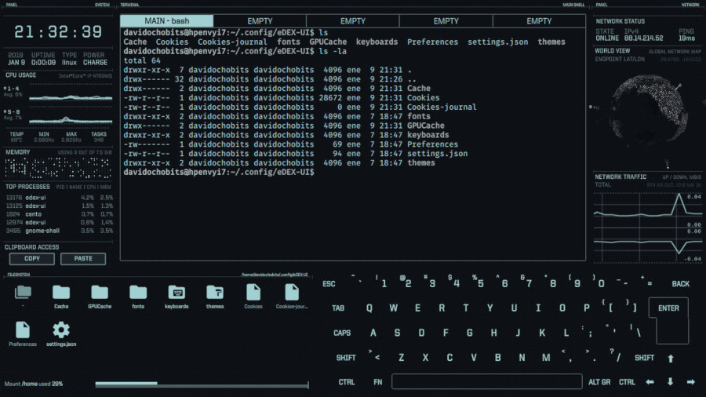
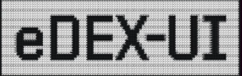

# 🖥️ eDEX-UI — Hacking Terminal

> Terminal interactiva con estética hacker, diseñada para aprender y experimentar con conceptos básicos de ciberseguridad.

## 🚀 Descripción

eDEX-UI es una terminal con una interfaz visual inspirada en sistemas de hacking y ciberseguridad.

El proyecto busca crear un entorno interactivo donde los usuarios puedan familiarizarse con comandos de terminal, herramientas de red y conceptos básicos de seguridad informática.

## 🎯 Objetivos

- 🖥️ Practicar comandos de terminal
- 🌐 Aprender conceptos básicos de redes
- 🔐 Introducirse en la ciberseguridad
- 🧪 Experimentar con herramientas de seguridad en entornos controlados
- 💻 Familiarizarse con interfaces tipo terminal

## 🛠️ Tecnologías

- Git
- GitHub
- Node.js
- JavaScript
- HTML
- CSS
- eDEX-UI

## ⚡ Características

- 🎨 Interfaz inspirada en terminales de hacking
- 📊 Monitoreo visual del sistema
- 🌐 Información de red
- ⌨️ Terminal interactiva
- 🔐 Orientado al aprendizaje de ciberseguridad

## 📚 Uso educativo

Este proyecto está pensado principalmente para **aprendizaje y experimentación**.

Las herramientas y técnicas de seguridad deben utilizarse únicamente en sistemas propios o en entornos donde se tenga autorización.

## 🖼️ Capturas

### Terminal



### Logo




## 📦 Instalación

1. Clona el repositorio:

```bash
git clone https://github.com/Marcos-Argel/Consola-eDEX-UI.git
